# Feuille de route — Refonte du Dashboard Créateur qoe.fi

> **Objectif :** livrer un dashboard créateur complet, à l'esthétique épurée/minimaliste
> (inspiration [`articles-client.tsx`](../apps/dashboard/src/app/(creator)/articles/articles-client.tsx)),
> procurant un sentiment de liberté. **Direction design retenue : neutre zinc/noir,
> vermillon `#EE4B2B` relégué à accent discret optionnel.**
>
> Stack : Next.js 16 (App Router) + Supabase Auth + Prisma + Server Actions + shadcn/ui.

---

## 📊 État des lieux (constat initial)

| Zone | État | Remarque |
|------|------|----------|
| [`articles`](../apps/dashboard/src/app/(creator)/articles/articles-client.tsx) | ✅ **Référence** | Style Apple-esque zinc épuré, CRUD complet, tabs textuels |
| [`articles/[id]`](../apps/dashboard/src/app/(creator)/articles/[id]/edit-article-client.tsx) | ⚠️ À vérifier | Éditeur Tiptap + paywall divider |
| [`articles/new`](../apps/dashboard/src/app/(creator)/articles/new/new-article-client.tsx) | ⚠️ À vérifier | Création article |
| [`(creator)/page.tsx`](../apps/dashboard/src/app/(creator)/page.tsx) | ❌ Placeholder | Page d'accueil dashboard |
| [`analytics`](../apps/dashboard/src/app/(creator)/analytics/page.tsx) | ❌ Placeholder | — |
| [`audience`](../apps/dashboard/src/app/(creator)/audience/page.tsx) | ❌ Placeholder | — |
| [`newsletters`](../apps/dashboard/src/app/(creator)/newsletters/page.tsx) | ❌ Placeholder | — |
| [`settings`](../apps/dashboard/src/app/(creator)/settings/page.tsx) | ❌ Placeholder | — |
| [`app-sidebar.tsx`](../apps/dashboard/src/features/dashboard/components/app-sidebar.tsx) | ✅ Fonctionnel | Inset variant, Supabase + Prisma + i18n |
| [`layout.tsx`](../apps/dashboard/src/app/(creator)/layout.tsx) | ✅ Fonctionnel | `SidebarProvider` + sticky header + `max-w-6xl` |
| [`globals.css`](../apps/dashboard/src/app/globals.css) | ⚠️ Conflit | Thème actif = "White & Red" vermillon, alors que la page articles utilise du zinc neutre |

**Conflit design majeur à résoudre en priorité :** la page de référence utilise des
hardcoded `zinc-*` qui contournent les tokens sémantiques (`--primary`, `--foreground`).
Il faut unifier tout le dashboard sur un **système de tokens neutres**.

---

## 🗺️ Roadmap par phases

```mermaid
flowchart LR
    P0[Phase 0 — Fondations design] --> P1[Phase 1 — Layout & shell]
    P1 --> P2[Phase 2 — Page d'accueil]
    P2 --> P3[Phase 3 — Articles]
    P3 --> P4[Phase 4 — Audience & CRM]
    P4 --> P5[Phase 5 — Analytics]
    P5 --> P6[Phase 6 — Newsletters]
    P6 --> P7[Phase 7 — Settings & branding]
    P7 --> P8[Phase 8 — Revue transversale]
    P8 --> P9[Phase 9 — QA & ship]
```

---

### Phase 0 — Fondations design system (PRÉREQUIS, bloque tout)

> Sans cette phase, chaque page reproduira l'incohérence actuelle. C'est le socle.

- [ ] **0.1** Réécrire [`globals.css`](../apps/dashboard/src/app/globals.css) : thème `:root` neutre
      zinc/noir (remplacer le "White & Red" vermillon). Garder le vermillon uniquement dans une
      variable `--accent-brand` optionnelle (utilisable via classe utilitaire `.accent-brand`).
- [ ] **0.2** Définir les tokens sémantiques définitifs : `--background`, `--foreground`,
      `--muted-foreground`, `--border`, `--primary` (= zinc-950), `--accent-brand` (vermillon, opt-in).
- [ ] **0.3** Créer un guide de style / cheatsheet ([`apps/dashboard/STYLE.md`](../apps/dashboard/STYLE.md)) référençant les
      patterns de la page articles : titre `text-2xl font-bold tracking-tight`, sous-titre poétique
      `text-zinc-400 text-xs`, tabs textuels avec underline `layoutId`, liste `space-y-1` avec
      `border-b border-zinc-100/60`, statut "quiet dot" `h-1.5 w-1.5 rounded-full`.
- [ ] **0.4** Refactorer [`articles-client.tsx`](../apps/dashboard/src/app/(creator)/articles/articles-client.tsx)
      pour remplacer les `zinc-*` hardcoded par les tokens sémantiques (vérifier parité visuelle).
- [ ] **0.5** Auditer [`components/ui/*`](../apps/dashboard/src/components/ui) : aligner `button`,
      `input`, `select`, `card` sur la nouvelle palette neutre.

### Phase 1 — Layout & shell unifié

- [ ] **1.1** Refondre [`app-sidebar.tsx`](../apps/dashboard/src/features/dashboard/components/app-sidebar.tsx) :
      esthétique plus épurée (icônes `stroke-[1.5]`, labels `text-xs`, suppression des bordures
      lourdes, header logo minimaliste).
- [ ] **1.2** Refondre [`layout.tsx`](../apps/dashboard/src/app/(creator)/layout.tsx) : header
      transversal avec recherche globale (`Cmd+K`), breadcrumbs discrets, supprimer le `max-w-6xl`
      global (chaque page gère sa propre largeur comme le fait déjà articles avec `max-w-3xl`).
- [ ] **1.3** Créer des composants layout réutilisables : `PageHeader` (titre + sous-titre poétique
      + action), `EmptyState` (icône + texte), `QuietList`, `TextTabs`.

### Phase 2 — Page d'accueil dashboard [`(creator)/page.tsx`](../apps/dashboard/src/app/(creator)/page.tsx)

- [ ] **2.1** Définir les métriques clés à afficher (articles publiés, abonnés, vues 30j, revenus).
- [ ] **2.2** Implémenter le fetch serveur via Prisma (réutiliser [`@qoe/db`](../packages/db)).
- [ ] **2.3** Design : "tableau de bord" minimaliste — pas de cards surchargées, plutôt une liste
      de sections épurées type "Aujourd'hui", "Vos écrits récents", "Audience".

### Phase 3 — Articles (consolidation de l'existant)

- [ ] **3.1** Auditer [`articles/[id]/edit-article-client.tsx`](../apps/dashboard/src/app/(creator)/articles/[id]/edit-article-client.tsx)
      et [`articles/new/new-article-client.tsx`](../apps/dashboard/src/app/(creator)/articles/new/new-article-client.tsx)
      pour conformité design system.
- [ ] **3.2** Vérifier le [`features/editor`](../apps/dashboard/src/features/editor) (Tiptap) :
      styling cohérent, barre d'outils épurée.
- [ ] **3.3** Finaliser les fonctionnalités manquantes : SEO fields, paywall divider, catégories,
      aperçu public.

### Phase 4 — Audience & CRM [`audience`](../apps/dashboard/src/app/(creator)/audience/page.tsx)

- [ ] **4.1** Lister les subscribers (modèle `Subscriber` dans
      [`schema.prisma`](../packages/db/prisma/schema.prisma)).
- [ ] **4.2** Gestion followers / blocked users (`Follows`, `BlockedUser`).
- [ ] **4.3** Vue minimaliste : liste épurée type "quiet list", filtres texte, actions discrètes.

### Phase 5 — Analytics [`analytics`](../apps/dashboard/src/app/(creator)/analytics/page.tsx)

- [ ] **5.1** Définir la source de données ([`@qoe/analytics`](../packages/analytics)).
- [ ] **5.2** Choisir une lib de charts légère et épurée (ex. `recharts` theme minimaliste, ou
      sparklines SVG maison).
- [ ] **5.3** Graphiques : vues, temps de lecture, sources. Esthétique zinc, traits fins `stroke-[1]`.

### Phase 6 — Newsletters [`newsletters`](../apps/dashboard/src/app/(creator)/newsletters/page.tsx)

- [ ] **6.1** Modèle de données `Letter` (existe dans le schéma : `LetterSender`/`LetterRecipient`).
- [ ] **6.2** CRUD newsletters : composer, planifier, brouillons, historique.
- [ ] **6.3** Intégration envoi (à définir : worker, provider email).

### Phase 7 — Settings & branding créateur [`settings`](../apps/dashboard/src/app/(creator)/settings/page.tsx)

- [ ] **7.1** Profil public (username, name, bio) — champs déjà dans `User`.
- [ ] **7.2** Thème & branding : `accentColor`, `fontFamily`, `logoUrl`, `heroText`,
      `headerImageUrl`, `footerText`, `themeMode`, `layoutStyle` (tous présents dans le schéma).
- [ ] **7.3** Domaine personnalisé : `subdomain`, `customDomain`.
- [ ] **7.4** SEO créateur : `seoTitle`, `seoDescription`, `allowIndexing`.
- [ ] **7.5** Monétisation : `stripeAccountId`, `stripeEnabled`, `supportUrl`.
- [ ] **7.6** Interface par sections repliables, esthétique "liste de réglages" minimaliste.

### Phase 8 — Revue transversale

- [ ] **8.1** i18n : toutes les chaînes via [`@qoe/i18n`](../packages/i18n) + fichiers
      [`messages/fr.json`](../messages/fr.json) / [`en.json`](../messages/en.json).
- [ ] **8.2** Accessibilité : contrastes AA, focus visibles, navigation clavier, `aria-*`.
- [ ] **8.3** Responsive : mobile (sidebar → `Sheet`), tablette, desktop large.
- [ ] **8.4** Dark mode : tokens `.dark` cohérents (le zinc neutre se prête bien au dark).
- [ ] **8.5** Cohérence sidebar/header/animations ([`motion-profiles.ts`](../apps/dashboard/src/lib/animations/motion-profiles.ts)).

### Phase 9 — QA & ship

- [ ] **9.1** Typecheck (`tsc --noEmit`) et lint (`eslint`) sur tout `apps/dashboard`.
- [ ] **9.2** Tests critiques ([`safe-action.ts`](../apps/dashboard/src/lib/safe-action.ts),
      actions articles).
- [ ] **9.3** Test local via [`dashboard.localhost`](http://dashboard.localhost) (cf. [`DEV.md`](../DEV.md)).
- [ ] **9.4** Vérifier la non-régression des apps voisines (`admin`, `feed`, `web`) qui partagent
      les packages.

---

## 🎯 Ordre de priorité recommandé

1. **Phase 0** (bloquant) → unifier les tokens avant d'écrire toute nouvelle UI.
2. **Phase 1** → shell & composants réutilisables (investissement rentabilisé sur toutes les pages).
3. **Phase 3** → consolider articles (déjà commencé, proche du but).
4. **Phase 2** → page d'accueil (première impression utilisateur).
5. **Phase 7** → settings (le créateur a besoin de configurer son branding tôt).
6. **Phase 4 → 5 → 6** → audience, analytics, newsletters (ajout de valeur incrémental).
7. **Phase 8 → 9** → qualité et livraison.

---

## ⚙️ Principes directeurs (à respecter à chaque phase)

- **Neutralité d'abord** : zinc/noir par défaut, vermillon `#EE4B2B` uniquement sur éléments
  brand volontaires (logo, CTA principal optionnel).
- **Tokens sémantiques > hardcoded** : jamais de `text-zinc-900` dans le nouveau code, toujours
  `text-foreground` / `text-muted-foreground`.
- **Densité faible, respiration haute** : `space-y-12`, `py-6`, `max-w-3xl` pour le contenu de
  lecture, `max-w-5xl` pour les listes.
- **Interactions discrètes** : `opacity-70 group-hover:opacity-100`, `quiet dots`, pas de bordures
  épaisses, transitions courtes (`transition-colors`).
- **Typographie poétique** : sous-titres évocateurs ("Un espace souverain pour cultiver le silence").
- **Server Components par défaut** : data fetch serveur, `"use client"` uniquement pour
  l'interactivité (cf. pattern [`page.tsx`](../apps/dashboard/src/app/(creator)/articles/page.tsx)
  + [`articles-client.tsx`](../apps/dashboard/src/app/(creator)/articles/articles-client.tsx)).
- **Sécurité** : toute action serveur via [`requireUser`](../packages/auth/src/current-user.ts)
  de [`@qoe/auth`](../packages/auth) (déjà en place dans [`actions.ts`](../apps/dashboard/src/app/(creator)/articles/actions.ts)).
