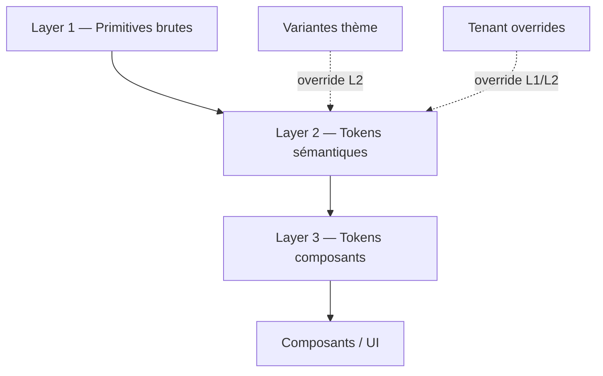

# Architecture — Système de Thème Unifié Multi-Apps qoe.fi

> **Vision :** un système de design tokens en couches, source unique de vérité,
> permettant de changer de thème (light/dark/futurs) de façon **unifiée sur toutes
> les apps**, tout en supportant le **branding par créateur** (blogs tenants) sans
> recodage.
>
> **Principe senior :** les composants ne connaissent que les **tokens sémantiques**
> (`text-foreground`, `bg-primary`). Ils n'ont jamais connaissance du thème concret
> (zinc, vermillon, dark…) ni du tenant. Le thème se résout au runtime via des
> **CSS custom properties**, ce qui permet de basculer de thème **sans recompilation
> et sans FOUC**, y compris en SSR.

---

## 1. Constat & problèmes actuels

| Problème | Détail |
|----------|--------|
| **5 copies de `globals.css`** | [`feed`](apps/feed/src/app/globals.css), [`dashboard`](apps/dashboard/src/app/globals.css), [`web`](apps/web/src/app/globals.css), [`landing`](apps/landing/src/app/globals.css), [`admin`](apps/admin/src/app/globals.css) — **identiques**, déjà divergentes |
| **Tokens sémantiques contournés** | [`articles-client.tsx`](apps/dashboard/src/app/(creator)/articles/articles-client.tsx) hardcode `text-zinc-900`, `bg-zinc-900` au lieu de `text-foreground`/`bg-primary` |
| **Thème actif incohérent** | `:root` = "White & Red" vermillon `#EE4B2B`, mais les thèmes oklch neutres sont commentés "ARCHIVED/PAUSED" dans chaque `globals.css` |
| **Theming tenant ad-hoc** | [`apps/web`](apps/web/src/app/tenant/[domain]/page.tsx) injecte `--tenant-accent` en inline, **non réutilisable**, bug `hsl(var(--primary))` alors que les tokens sont en oklch |
| **[`tokens.ts`](packages/ui/src/tokens.ts) désynchronisé** | Palette JS vermillon/sepia qui ne reflète plus la réalité CSS, risque d'écart charts vs UI |
| **Pas de registre de thèmes** | Aucun moyen type-safe de lister/switcher les thèmes disponibles côté admin/settings |

---

## 2. Architecture cible — Design Tokens en 3 couches

Inspiré de Material 3 / Radix / Brad Frost. **Chaque couche ne référence que la
précédente**, jamais en sautant.



### Layer 1 — Primitives (palette brute, **jamais utilisée directement**)

Valeurs brutes (zinc scale, vermillon scale, oklch). Déclarées une seule fois.

```css
:root {
  /* Neutrals — zinc */
  --zinc-0:   #ffffff;
  --zinc-50:  #fafafa;
  --zinc-100: #f4f4f5;
  --zinc-200: #e4e4e7;
  --zinc-300: #d4d4d8;
  --zinc-400: #a1a1aa;
  --zinc-500: #71717a;
  --zinc-600: #52525b;
  --zinc-700: #3f3f46;
  --zinc-800: #27272a;
  --zinc-900: #18181b;
  --zinc-950: #09090b;

  /* Brand — vermillon (accent optionnel) */
  --vermillion-400: #E55A2E;
  --vermillion-500: #EE4B2B;
  --vermillion-600: #C7331A;

  /* Radii */
  --radius-base: 0.5rem;
}
```

### Layer 2 — Sémantiques (ce que les composants utilisent)

Mappings sémantiques vers les primitives. **Seule cette couche change entre thèmes.**

```css
:root {
  /* Light (thème neutre par défaut — aligné sur la décision zinc/noir) */
  --background:          var(--zinc-0);
  --foreground:          var(--zinc-950);
  --card:                var(--zinc-0);
  --card-foreground:     var(--zinc-950);
  --popover:             var(--zinc-0);
  --popover-foreground:  var(--zinc-950);
  --primary:             var(--zinc-950);   /* neutre, pas vermillon */
  --primary-foreground:  var(--zinc-0);
  --secondary:           var(--zinc-100);
  --secondary-foreground:var(--zinc-950);
  --muted:               var(--zinc-100);
  --muted-foreground:    var(--zinc-500);
  --accent:              var(--zinc-100);
  --accent-foreground:   var(--zinc-950);
  --border:              var(--zinc-200);
  --input:               var(--zinc-200);
  --ring:                var(--zinc-950);
  --destructive:         var(--vermillion-600);

  /* Brand accent — opt-in, NON utilisé par défaut */
  --accent-brand:        var(--vermillion-500);
  --accent-brand-fg:     var(--zinc-0);

  /* Sidebar */
  --sidebar:             var(--zinc-0);
  --sidebar-foreground:  var(--zinc-950);
  --sidebar-border:      var(--zinc-200);
  --sidebar-accent:      var(--zinc-100);
  --sidebar-ring:        var(--zinc-950);
}

.dark {
  --background:          var(--zinc-950);
  --foreground:          var(--zinc-50);
  --card:                var(--zinc-900);
  --card-foreground:     var(--zinc-50);
  --primary:             var(--zinc-50);
  --primary-foreground:  var(--zinc-950);
  --muted:               var(--zinc-900);
  --muted-foreground:    var(--zinc-400);
  --border:              var(--zinc-800);
  --input:               var(--zinc-800);
  --ring:                var(--zinc-50);
  --sidebar:             var(--zinc-950);
  --sidebar-foreground:  var(--zinc-50);
  --sidebar-border:      var(--zinc-800);
}
```

### Layer 3 — Composants (optionnel, mappent vers sémantiques)

Pour les cas fins (ex. sidebar a un accent légèrement différent du card).

```css
:root {
  --button-primary-bg:    var(--primary);
  --button-primary-fg:    var(--primary-foreground);
  --quiet-dot-published:  oklch(0.7 0.15 152);  /* emerald, statut seulement */
  --quiet-dot-draft:      var(--zinc-300);
}
```

### Variantes via data-attributes (basculent les sémantiques)

Permet d'activer le vermillon comme accent brand **sans toucher au code** :

```css
[data-accent="vermillion"] {
  --primary:            var(--vermillion-500);
  --primary-foreground: var(--zinc-0);
  --ring:               var(--vermillion-500);
  --sidebar-ring:       var(--vermillion-500);
}
```

Usage : `<html data-accent="vermillion">` ou sur un sous-arbre
`<section data-accent="vermillion">`. Le dashboard reste neutre par défaut ;
un créateur peut activer l'accent brand sur **son blog public** uniquement.

---

## 3. Package `@qoe/theme` — Source unique

Création d'un **nouveau package** [`packages/theme`](packages/theme) (séparation de
concerns : le design system CSS/logique est distinct des composants React de
[`@qoe/ui`](packages/ui)).

```mermaid
flowchart LR
    subgraph packages/theme
        styles[tokens.css<br/>themes.css]
        registry[registry.ts<br/>types, thèmes dispo]
        ThemeStyle[ThemeStyle.tsx<br/>tenant overrides SSR]
        Provider[ThemeProvider.tsx<br/>next-themes wrapper]
    end
    ui[@qoe/ui] -->|re-export| theme
    apps[apps/* feed dashboard web admin landing] -->|import styles| theme
    webapp[apps/web tenant] -->|ThemeStyle| theme
```

### Structure du package

```
packages/theme/
├── package.json            # name: @qoe/theme
├── src/
│   ├── styles/
│   │   ├── tokens.css      # Layer 1 + 2 primitives/sémantiques
│   │   ├── themes.css      # .dark, [data-accent], variantes futures
│   │   └── index.css       # @import tokens + themes (point d'entrée unique)
│   ├── registry.ts         # TypeScript: liste type-safe des thèmes
│   ├── types.ts            # CreatorTheme, ThemeMode, AccentVariant
│   ├── ThemeStyle.tsx      # Server Component: injecte vars tenant depuis DB
│   ├── ThemeProvider.tsx   # Client: next-themes (light/dark/system)
│   └── index.ts            # re-exports
```

### `registry.ts` — registre type-safe des thèmes

```ts
export const THEMES = {
  light: { id: "light", label: "Light", dataTheme: "light" },
  dark:  { id: "dark",  label: "Dark",  dataTheme: "dark" },
} as const;

export const ACCENTS = {
  none:       { id: "none",       label: "Neutre",     dataAccent: null },
  vermillion: { id: "vermillion", label: "Vermillon",  dataAccent: "vermillion" },
} as const;

export type ThemeId = keyof typeof THEMES;
export type AccentId = keyof typeof ACCENTS;
```

### `ThemeStyle.tsx` — overrides tenant (SSR, zéro FOUC)

```tsx
// Server Component — lit le créateur depuis la DB, injecte ses vars
export function ThemeStyle({ creator }: { creator: CreatorTheme }) {
  const vars: Record<string, string> = {};
  if (creator.accentColor) vars["--primary"] = creator.accentColor;
  if (creator.fontFamily)  vars["--font-active"] = `var(--font-${creator.fontFamily})`;
  // ...
  const css = Object.entries(vars)
    .map(([k, v]) => `${k}: ${v};`).join(" ");
  return <style dangerouslySetInnerHTML={{ __html: `:root { ${css} }` }} />;
}
```

### `ThemeProvider.tsx` — wrapper next-themes

Réexporte le wrapper existant de [`@qoe/ui`](packages/ui/src/theme-provider.tsx)
mais force l'attribut `data-theme` (au lieu de `class`) pour cohérence avec les
`[data-accent]`. Supporte `forcedTheme` pour les blogs tenants où le créateur
choisit le mode (champ `themeMode` du schéma).

---

## 4. Intégration par app

### Toutes les apps — `apps/*/src/app/layout.tsx`

```tsx
// AVANT : import "./globals.css"  (5 copies divergentes)
// APRÈS :
import "@qoe/theme/styles";   // source unique
```

Suppression des 5 `globals.css` locaux (ou réduction à 1 ligne d'import).
Mise à jour de [`components.json`](components.json) :
`"css": "node_modules/@qoe/theme/dist/styles/index.css"`.

### Apps tenant (`apps/web`) — branding créateur

```tsx
// apps/web/src/app/tenant/[domain]/page.tsx
import { ThemeStyle, ThemeProvider } from "@qoe/theme";

return (
  <ThemeProvider forcedTheme={creator.themeMode} attribute="data-theme">
    <ThemeStyle creator={creator} />
    <TenantHeader ... />
    {children}
  </ThemeProvider>
);
```

Remplace l'inline `customStyle` actuel (buggy) par une approche token-based
réutilisable. Le `--tenant-accent` ad-hoc disparaît au profit de l'override
direct de `--primary`.

### Dashboard créateur — reste neutre

Le [`dashboard`](apps/dashboard) n'applique **pas** d'accent brand par défaut
(décision zinc/noir). Les composants utilisent uniquement `text-foreground`,
`bg-primary`, etc. Le vermillon n'apparaît que si l'utilisateur active
`data-accent="vermillion"` via les settings (futur toggle).

---

## 5. Synchronisation tokens CSS ↔ JS

[`tokens.ts`](packages/ui/src/tokens.ts) actuel sera refactoré pour **ne plus
déclarer de palette en dur** mais exposer des helpers qui lisent les vars CSS au
runtime (pour charts/canvas) :

```ts
// lit la valeur résolue du token sémantique
export function token(name: string): string {
  if (typeof window === "undefined") return "";
  return getComputedStyle(document.documentElement)
    .getPropertyValue(name).trim();
}
// ex: token('--primary') → "#09090b" en light, "#fafafa" en dark
```

Les charts (recharts/visx) consomment `token('--primary')` au lieu d'une couleur
hardcodée → ils suivent automatiquement le thème actif. La palette `COLORS`
vermillon/sepia est déplacée vers `registry.ts` comme primitives de référence
uniquement (pour les `<option>` de color picker dans les settings).

---

## 6. Avantages de l'architecture

| Avantage | Détail |
|----------|--------|
| **DRY** | 1 source CSS au lieu de 5 copies |
| **Pas de recompilation** | Changer de thème = basculer une classe/attribut, runtime pur |
| **Zéro FOUC** | `:root` + `ThemeStyle` SSR injectent les bonnes vars avant hydration |
| **Multi-tenant isolé** | Chaque blog créateur a son thème (override `:root` local), indépendant du reader |
| **Type-safe** | `registry.ts` liste les thèmes/accents dispo, autocomplétion dans settings/admin |
| **Extensible** | Ajouter un thème = 1 bloc CSS `[data-accent="..."]`, 1 entrée registry |
| **Charts cohérents** | `token()` lit les vars résolues, plus de divergence UI/charts |
| **Dark mode gratuit** | Les sémantiques neutres se prêtent au `.dark` sans retravail |

---

## 7. Plan d'implémentation (s'insère avant la Phase 0 du roadmap)

Cette architecture devient le **nouveau socle**. Elle remplace l'ancienne "Phase 0".

- [ ] **T0.1** Créer [`packages/theme`](packages/theme) (scaffold, `package.json`, tsconfig)
- [ ] **T0.2** Écrire `styles/tokens.css` (Layer 1+2 zinc neutre) + `styles/themes.css` (`.dark`, `[data-accent]`)
- [ ] **T0.3** Écrire `registry.ts`, `types.ts`, `ThemeStyle.tsx`, `ThemeProvider.tsx`, `index.ts`
- [ ] **T0.4** Brancher [`@qoe/ui`](packages/ui) : re-export `ThemeProvider` depuis `@qoe/theme`, refactor [`tokens.ts`](packages/ui/src/tokens.ts) → `token()` helper
- [ ] **T0.5** Migrer chaque app : remplacer `import "./globals.css"` par `import "@qoe/theme/styles"` dans les 5 [`layout.tsx`](apps/dashboard/src/app/layout.tsx)
- [ ] **T0.6** Supprimer les 5 `globals.css` locaux (garder 1 alias si besoin compat)
- [ ] **T0.7** Refactor [`apps/web`](apps/web/src/app/tenant/[domain]/page.tsx) : remplacer inline `customStyle` par `<ThemeStyle>` + `forcedTheme`
- [ ] **T0.8** Refactor [`articles-client.tsx`](apps/dashboard/src/app/(creator)/articles/articles-client.tsx) : `zinc-*` hardcoded → `foreground`/`primary`/`muted-foreground`
- [ ] **T0.9** Vérifier non-régression visuelle sur les 5 apps + charts
- [ ] **T0.10** Mettre à jour [`components.json`](components.json) (chemin CSS) + [`STYLE.md`](apps/dashboard/STYLE.md) avec le guide des tokens

Une fois T0 terminé, les Phases 1→9 du [`dashboard-creator-roadmap.md`](dashboard-creator-roadmap.md)
s'appuient sur un socle sain : chaque nouvelle page consomme `text-foreground` etc.
et hérite gratuitement du dark mode + futurs accents.
